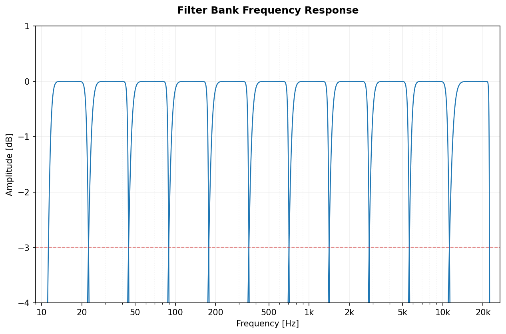
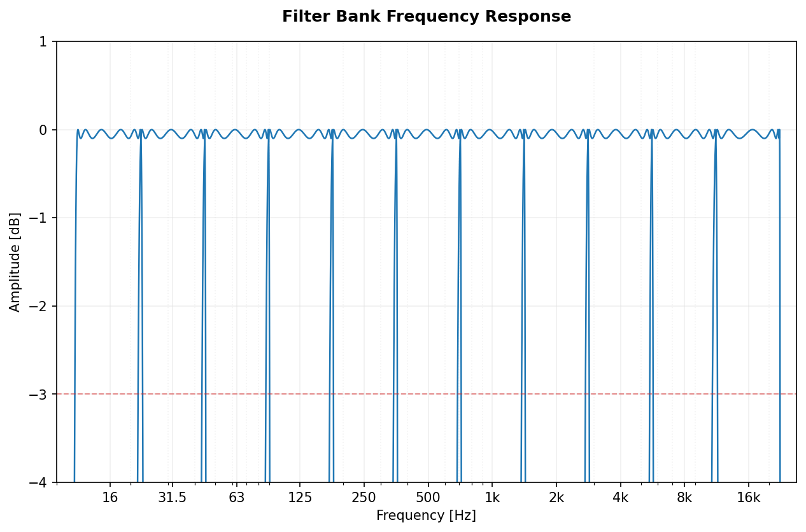
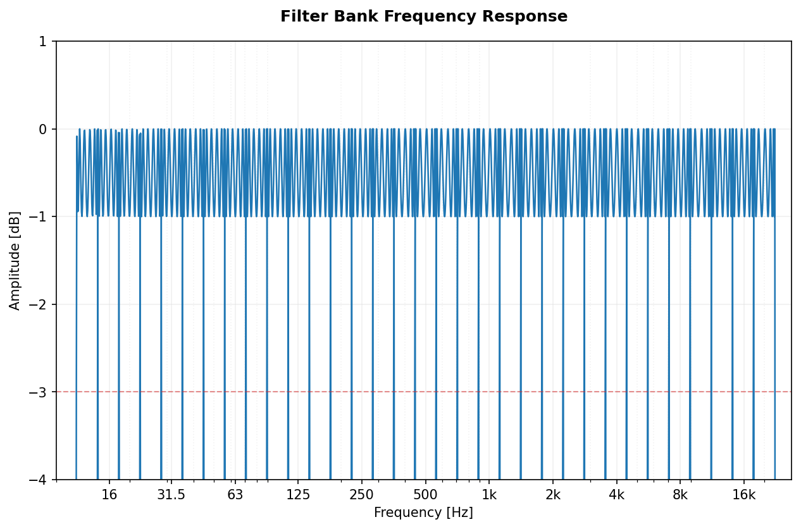
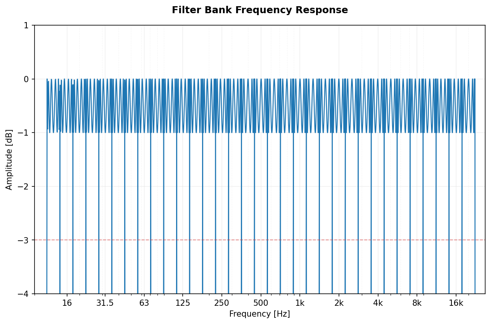

[](https://www.paypal.com/donate?hosted_button_id=BLP3R6VGYJB4Q)
[](https://ko-fi.com/jmrplens) 
[](https://github.com/jmrplens/PyOctaveBand/actions/workflows/python-app.yml)

# PyOctaveBand
Octave-Band and Fractional Octave-Band filter for signals in the time domain. Implementation according to ANSI s1.11-2004 and IEC 61260-1-2014.

### Getting Started

#### Installation

To use `PyOctaveBand`, you can clone the repository or add it as a git submodule:

**Cloning the repository:**
```bash
git clone https://github.com/jmrplens/PyOctaveBand.git
cd PyOctaveBand
pip install .
```

**As a Git Submodule:**
```bash
git submodule add https://github.com/jmrplens/PyOctaveBand.git
# Install in editable mode to use within your project
pip install -e ./PyOctaveBand
```

#### Integration / Usage

```python
import numpy as np
from pyoctaveband import octavefilter

# 1. Prepare your signal (e.g., 1 second sine wave at 1000 Hz)
fs = 48000
t = np.linspace(0, 1, fs)
signal = np.sin(2 * np.pi * 1000 * t)

# 2. Apply the 1/3 octave band filter
# Returns: spl (Sound Pressure Level) and freq (Center frequencies)
spl, freq = octavefilter(signal, fs=fs, fraction=3)

print(f"Center Frequencies: {freq}")
print(f"SPL per band: {spl}")
```

#### Multichannel Support
PyOctaveBand supports multichannel processing. Input `x` can be a 1D array or a 2D array with shape `(channels, samples)`.

### Public Methods

##### octavefilter
Filters the input signal according to the selected parameters.
```python
# Returns Sound Pressure Level and Frequencies
spl, freq = octavefilter(x, fs, fraction=1, order=6, limits=None)

# Advanced filters: 'butter', 'cheby1', 'cheby2', 'ellip', 'bessel'
spl, freq = octavefilter(x, fs, filter_type='cheby1', ripple=1.0)
```

##### OctaveFilterBank (Class)
For high-performance applications where you need to filter multiple signals with the same configuration, use the `OctaveFilterBank` class. This avoids re-calculating filter coefficients for every call.

```python
from pyoctaveband import OctaveFilterBank

# Initialize the bank once
bank = OctaveFilterBank(fs=48000, fraction=3, order=6)

# Filter multiple signals efficiently
spl1, freq = bank.filter(signal1)
spl2, freq = bank.filter(signal2)
```

##### getansifrequencies
Returns the frequency vector according to ANSI s1.11-2004 and IEC 61260-1-2014 standards.
```python
freq, freq_d, freq_u = getansifrequencies(fraction, limits=None)
```

### The Filter
The library supports multiple filter architectures (Butterworth, Chebyshev, Elliptic, Bessel) with Second-Order Sections (SOS) coefficients. It applies automatic downsampling for low-frequency bands to maintain numerical stability and ensure the filter response matches the standards perfectly.

### Filter Type Comparison
Comparison of different filter types for the same band (1kHz, order 6).

</img>

### Examples of Filter Bank Responses
The following plots show the frequency response of the designed filters across the full spectrum.

| Fraction | Butterworth       | Chebyshev I (1dB ripple)      | Elliptic (1dB, 60dB) |
|:-------------:|:-------------:|:-------------:|:-------------:|
| 1-octave | </img> | </img> | </img> |
| 1/3-octave | </img> | </img> | </img> |

### Signal Analysis Examples

| 1/1 Octave Band Analysis       | 1/3 Octave Band Analysis      | 
|:-------------:|:-------------:|
| </img>      | </img>  |

#### Multichannel Processing
Simultaneous analysis of a stereo signal (Left Channel: Pink Noise, Right Channel: Logarithmic Sine Sweep).

</img>

#### Signal Decomposition and Stability
By setting `sigbands=True`, you can retrieve the signal components for each individual frequency band. The last plot shows the **Impulse Response** of a specific band, useful for visualizing filter stability.

</img>

# Development

### Modular Architecture
The codebase is organized into specialized modules:
- `core.py`: Main `OctaveFilterBank` class and processing logic.
- `filter_design.py`: SOS filter design and visualization tools.
- `frequencies.py`: ANSI/IEC standard frequency calculations.
- `utils.py`: Signal validation and resampling utilities.

### Running Tests
```bash
make check
```

### Generating Graphs
```bash
python generate_graphs.py
```

## Contributing
Please check [CONTRIBUTING.md](CONTRIBUTING.md) and open an [Issue](https://github.com/jmrplens/PyOctaveBand/issues) or a [Pull Request](https://github.com/jmrplens/PyOctaveBand/pulls).

# Author
Jose M. Requena Plens, 2020.
