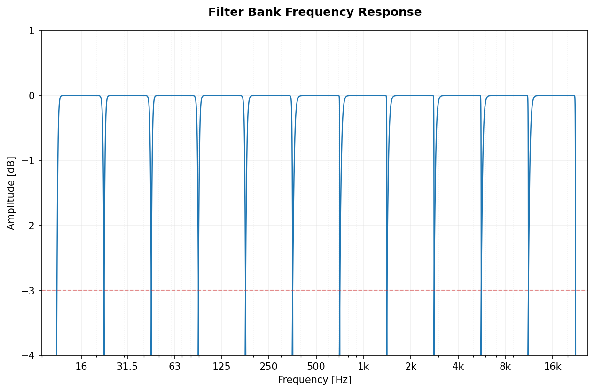
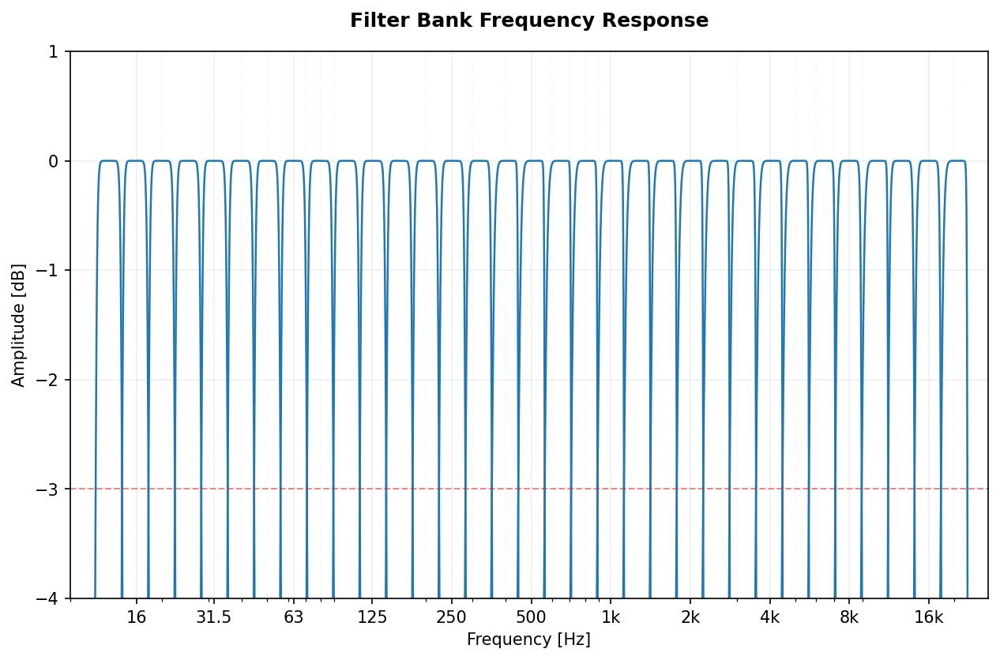
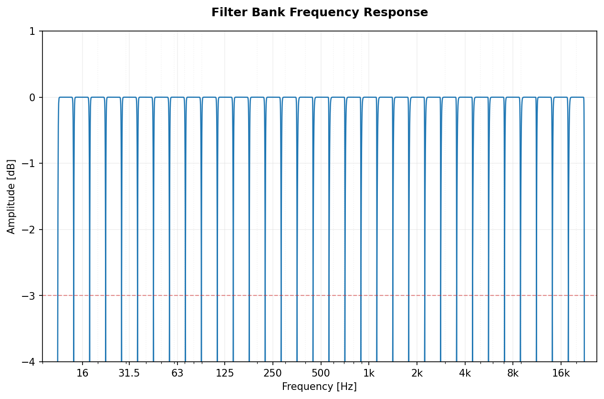
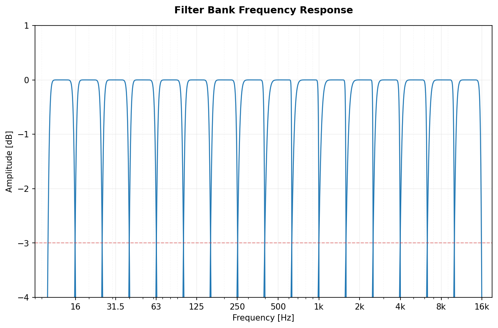
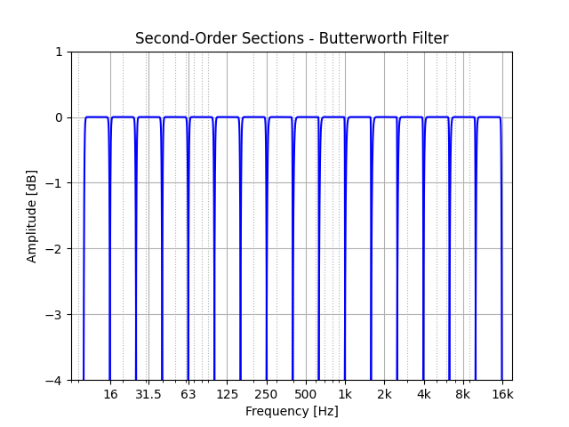
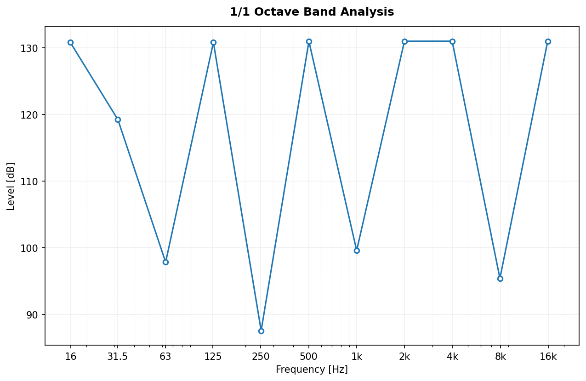
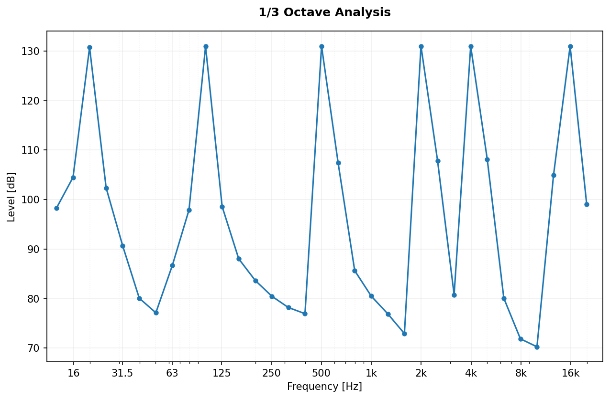
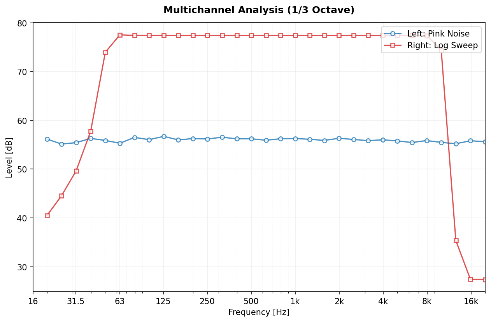
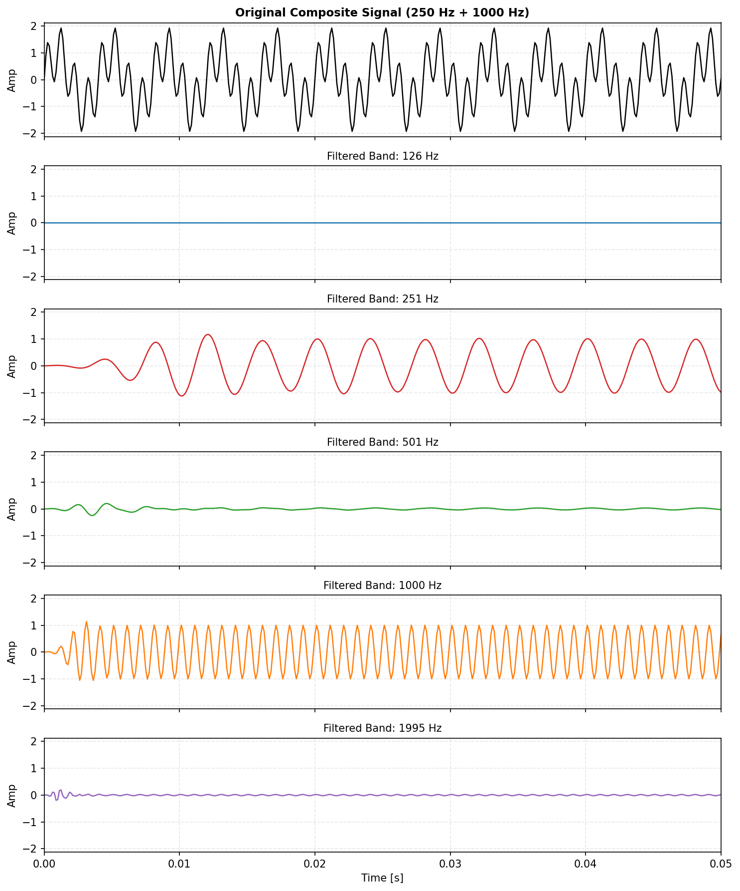

[](https://www.paypal.com/donate?hosted_button_id=BLP3R6VGYJB4Q)
[](https://ko-fi.com/jmrplens) 
[](https://github.com/jmrplens/PyOctaveBand/actions/workflows/python-app.yml)

# PyOctaveBand
Octave-Band and Fractional Octave-Band filter for signals in the time domain. Implementation according to ANSI s1.11-2004 and IEC 61260-1-2014.

### Getting Started

#### Installation

To use `PyOctaveBand`, you can clone the repository or add it as a git submodule:

**Cloning the repository:**
```bash
git clone https://github.com/jmrplens/PyOctaveBand.git
cd PyOctaveBand
pip install .
```

**As a Git Submodule:**
```bash
git submodule add https://github.com/jmrplens/PyOctaveBand.git
# Install in editable mode to use within your project
pip install -e ./PyOctaveBand
```

#### Integration / Usage

```python
import numpy as np
from pyoctaveband import octavefilter

# 1. Prepare your signal (e.g., 1 second sine wave at 1000 Hz)
fs = 48000
t = np.linspace(0, 1, fs)
signal = np.sin(2 * np.pi * 1000 * t)

# 2. Apply the 1/3 octave band filter
# Returns: spl (Sound Pressure Level) and freq (Center frequencies)
spl, freq = octavefilter(signal, fs=fs, fraction=3)

print(f"Center Frequencies: {freq}")
print(f"SPL per band: {spl}")
```

#### Multichannel Support
PyOctaveBand supports multichannel processing. Input `x` can be a 1D array or a 2D array with shape `(channels, samples)`.

### Public Methods

##### octavefilter
Filters the input signal according to the selected parameters.
```python
# Returns Sound Pressure Level and Frequencies
spl, freq = octavefilter(x, fs, fraction=1, order=6, limits=None)

# Returns SPL, Frequencies, and the filtered signals divided into bands
spl, freq, xb = octavefilter(x, fs, fraction=3, sigbands=True)
```

##### getansifrequencies
Returns the frequency vector according to ANSI s1.11-2004 and IEC 61260-1-2014 standards.
```python
freq, freq_d, freq_u = getansifrequencies(fraction, limits=None)
```

##### normalizedfreq
Returns normalized frequency vectors for octave and 1/3 octave bands.
```python
freq = normalizedfreq(fraction)
```

### The Filter
The library uses Butterworth filters with Second-Order Sections (SOS) coefficients. It applies automatic downsampling for low-frequency bands to maintain numerical stability and ensure the filter response matches the standards perfectly.

### Examples of Filter Bank Responses
The following plots show the frequency response of the designed filters. The red dashed line indicates the **-3 dB** point.

| Fraction | Butterworth order: 6       | Butterworth order: 16      | 
|:-------------:|:-------------:|:-------------:|
| 1-octave | </img>      | </img>  |
| 1/3-octave | </img>      | </img>  |
| 2/3-octave | </img>      | </img>  |

### Signal Analysis Examples

| 1/1 Octave Band Analysis       | 1/3 Octave Band Analysis      | 
|:-------------:|:-------------:|
| </img>      | </img>  |

#### Multichannel Processing
Simultaneous analysis of a stereo signal (Left Channel: Pink Noise, Right Channel: Logarithmic Sine Sweep).

</img>

#### Signal Decomposition (Time Domain)
By setting `sigbands=True`, you can retrieve the signal components for each individual frequency band.

</img>

<details>
<summary><b>Click to see the code for this example</b></summary>

```python
import numpy as np
from pyoctaveband import octavefilter

# 1. Generate a composite signal (Sum of 250Hz and 1000Hz sines)
fs = 8000
t = np.linspace(0, 0.5, fs // 2, endpoint=False)
y = np.sin(2 * np.pi * 250 * t) + np.sin(2 * np.pi * 1000 * t)

# 2. Filter into 1/1 octave bands and get time-domain signals
# We use sigbands=True to get the 'xb' list of filtered signals
spl, freq, xb = octavefilter(y, fs=fs, fraction=1, sigbands=True)

# 'xb' contains the isolated signal for each band
# xb[i] corresponds to the center frequency freq[i]
```
</details>

# Development

### Running Tests
```bash
make check
```

### Generating Graphs
```bash
python generate_graphs.py
```

# Roadmap
- Performance optimizations for very long signals
- Support for more filter types (Chebyshev, etc.)

## Contributing
Please check [CONTRIBUTING.md](CONTRIBUTING.md) and open an [Issue](https://github.com/jmrplens/PyOctaveBand/issues) or a [Pull Request](https://github.com/jmrplens/PyOctaveBand/pulls).

# Author
Jose M. Requena Plens, 2020.