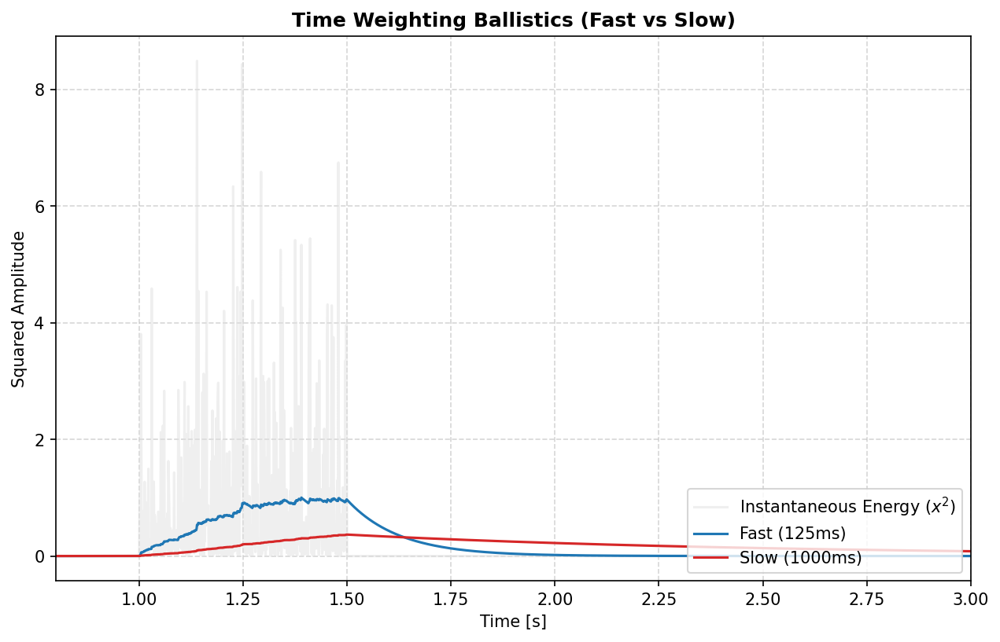

[](https://www.paypal.com/donate?hosted_button_id=BLP3R6VGYJB4Q)
[](https://ko-fi.com/jmrplens) 
[](https://github.com/jmrplens/PyOctaveBand/actions/workflows/python-app.yml)

# PyOctaveBand
Advanced Octave-Band and Fractional Octave-Band filter bank for signals in the time domain. Fully compliant with **ANSI s1.11-2004** and **IEC 61260-1-2014**.

This library provides professional-grade tools for acoustic analysis, including frequency weighting (A, C, Z), time ballistics (Fast, Slow, Impulse), and multiple filter architectures.

---

## 📑 Table of Contents
1. [🚀 Getting Started](#-getting-started)
2. [🛠️ Filter Architectures](#️-filter-architectures)
3. [🔊 Acoustic Weighting (A, C, Z)](#-acoustic-weighting-a-c-z)
4. [⏱️ Time Weighting and Integration](#️-time-weighting-and-integration)
5. [⚡ Performance: OctaveFilterBank](#-performance-octavefilterbank-class)
6. [🔀 Linkwitz-Riley Crossover](#-linkwitz-riley-crossover)
7. [📊 Signal Decomposition](#-signal-decomposition-and-stability)
8. [📖 Theory and Equations](#-theoretical-background)
9. [🧪 Testing and Quality](#-development-and-verification)

---

## 🚀 Getting Started

### Installation

You can install `PyOctaveBand` by cloning the repository or adding it as a git submodule to your project.

**Option 1: Cloning and Installing**
```bash
git clone https://github.com/jmrplens/PyOctaveBand.git
cd PyOctaveBand
pip install .
```

**Option 2: Git Submodule (Recommended for projects)**
Add PyOctaveBand as a dependency within your own git repository:
```bash
git submodule add https://github.com/jmrplens/PyOctaveBand.git
# Then install in editable mode to use it from your project
pip install -e ./PyOctaveBand
```

### Basic Usage: 1/3 Octave Analysis
Analyze a signal and get the Sound Pressure Level (SPL) per frequency band.

```python
import numpy as np
from pyoctaveband import octavefilter

fs = 48000
t = np.linspace(0, 1, fs)
# Composite signal: 100Hz + 1000Hz
signal = np.sin(2 * np.pi * 100 * t) + np.sin(2 * np.pi * 1000 * t)

# Apply 1/3 octave filter bank
spl, freq = octavefilter(signal, fs=fs, fraction=3)

print(f"Bands: {freq}")
print(f"SPL [dB]: {spl}")
```

---

## 🛠️ Filter Architectures

PyOctaveBand allows choosing between different filter types to balance between roll-off steepness and transient response (ringing).

### Filter Comparison Table

| Type | Name | Description | Best For |
| :--- | :--- | :--- | :--- |
| `butter` | **Butterworth** | Maximally flat passband. | Standard acoustic measurements. |
| `cheby1` | **Chebyshev I** | Steeper roll-off, ripple in passband. | High selectivity requirements. |
| `cheby2` | **Chebyshev II** | Flat passband, ripple in stopband. | Clean passband with good rejection. |
| `ellip` | **Elliptic** | Steepest transition, ripples in both. | Extreme isolation between bands. |
| `bessel` | **Bessel** | Linear phase, minimal group delay. | Preserving pulse shapes/transients. |
| `lr` | **Linkwitz-Riley**| 4th order (LR4), flat sum response. | Audio crossovers and band splitting. |

</img>

---

## 🔊 Acoustic Weighting (A, C, Z)

Frequency weighting curves simulate the human ear's sensitivity.

</img>

*   **A-Weighting (`A`):** Standard for environmental noise (IEC 61672-1).
*   **C-Weighting (`C`):** Used for peak sound pressure and high-level noise.
*   **Z-Weighting (`Z`):** Zero weighting, completely flat response.

```python
from pyoctaveband import weighting_filter

# Apply A-weighting to the raw signal
weighted_signal = weighting_filter(signal, fs, curve='A')
```

---

## ⏱️ Time Weighting and Integration

Accurate SPL measurement requires capturing energy over specific time windows.

</img>

*   **Fast (`fast`):** $\tau = 125$ ms. Standard for noise fluctuations.
*   **Slow (`slow`):** $\tau = 1000$ ms. Standard for steady noise.
*   **Impulse (`impulse`):** 35 ms rise time. For explosive sounds.

```python
from pyoctaveband import time_weighting

# Calculate energy envelope (Mean Square)
energy_envelope = time_weighting(signal, fs, mode='fast')
# dB SPL relative to 20μPa
spl_t = 10 * np.log10(energy_envelope / (2e-5)**2)
```

---

## ⚡ Performance: OctaveFilterBank Class

Pre-calculating coefficients saves significant CPU time when processing multiple frames.

```python
from pyoctaveband import OctaveFilterBank

bank = OctaveFilterBank(fs=48000, fraction=3, filter_type='butter')

# Process multiple signals efficiently
for frame in stream:
    spl, freq = bank.filter(frame)
```

---

## 🔀 Linkwitz-Riley Crossover

Perfect for splitting audio into sub/top or multi-way systems.

</img>

```python
from pyoctaveband import linkwitz_riley

# Split at 1000 Hz using LR4
low, high = linkwitz_riley(signal, fs, freq=1000, order=4)
# (low + high) will be identical to original signal in magnitude and phase.
```

---

## 📊 Signal Decomposition and Stability

Retrieve the time-domain components of each band with `sigbands=True`.

</img>

---

## 📖 Theoretical Background

### Octave Band Frequencies (ANSI S1.11)
The exact mid-band frequencies ($f_m$) and band edges ($f_1, f_2$) are calculated using a base-10 system:
- Exact mid-band: $f_m = f_r \cdot 10^{\frac{3x}{10b}}$ (for odd $b$)
- Band edges: $f_1 = f_m \cdot G^{-1/2b}$ and $f_2 = f_m \cdot G^{1/2b}$
Where $G = 10^{0.3}$ and $f_r = 1000$ Hz.

### Weighting Curves (IEC 61672-1)
The A-weighting transfer function in the frequency domain is defined as:
$$R_A(f) = \frac{12194^2 \cdot f^4}{(f^2 + 20.6^2)\sqrt{(f^2 + 107.7^2)(f^2 + 737.9^2)}(f^2 + 12194^2)}$$
$$A(f) = 20 \log_{10}(R_A(f)) + 2.00$$

### Time Integration
Implemented as a first-order IIR exponential integrator:
$$y[n] = \alpha \cdot x^2[n] + (1 - \alpha) \cdot y[n-1]$$
$$\alpha = 1 - e^{-1 / (f_s \cdot \tau)}$$

---

## 🧪 Development and Verification

We maintain 100% stability and compliance through a rigorous test suite.

### Test Categories
1.  **Isolation Tests:** Verifies that a pure 1kHz tone is attenuated by >20dB in the 250Hz and 4kHz bands.
2.  **Weighting Response:** Checks gains at 100Hz (-19.1dB for A) and 1kHz (0dB).
3.  **Stability (IR Tail):** Analyzes the Impulse Response of every filter. Energy in the last 100ms must be $< 10^{-6}$ to pass.
4.  **Crossover Flatness:** Verifies that the sum of Linkwitz-Riley bands has $< 0.1$ dB deviation.

### Commands
```bash
# Run full suite
pytest tests/

# Generate technical report
python scripts/benchmark_filters.py
```

# Author
Jose M. Requena Plens, 2020 - 2026.
