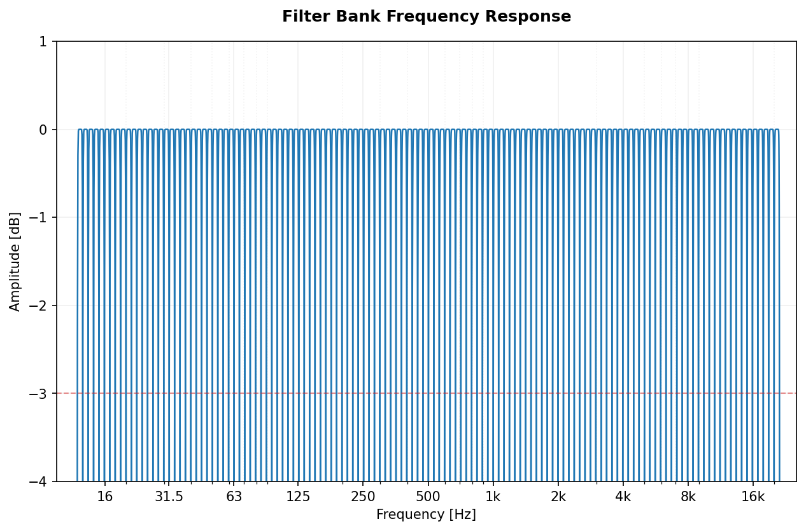
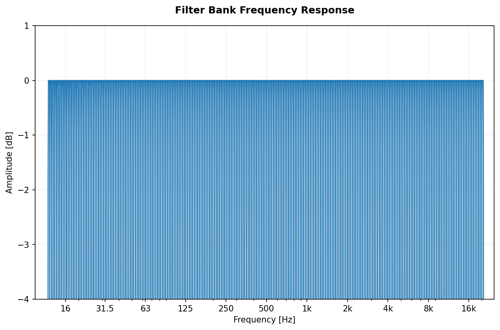

[](https://www.paypal.com/donate?hosted_button_id=BLP3R6VGYJB4Q)
[](https://ko-fi.com/jmrplens) 
[](https://github.com/jmrplens/PyOctaveBand/actions/workflows/python-app.yml)

# PyOctaveBand
Octave-Band and Fractional Octave-Band filter. For signal in time domain.

### Getting Started

#### Installation

You can install the package directly from source:

```bash
pip install .
```
Or if you are developing locally:
```bash
pip install -e .
```

#### Integration / Usage

Here is a simple example of how to use `PyOctaveBand` in your own Python project to filter a signal:

```python
import numpy as np
from pyoctaveband import octavefilter

# 1. Prepare your signal (e.g., a 1 second sine wave at 1000 Hz)
fs = 48000
t = np.linspace(0, 1, fs)
signal = np.sin(2 * np.pi * 1000 * t)

# 2. Apply the 1/3 octave band filter
# Returns:
# - spl: Sound Pressure Level for each band
# - freq: Center frequencies of the bands
spl, freq = octavefilter(signal, fs=fs, fraction=3)

# 3. Print results
print(f"Center Frequencies: {freq}")
print(f"SPL per band: {spl}")
```

#### Multichannel Support
PyOctaveBand supports multichannel signals. Input `x` can be a 1D array (single channel) or a 2D array with shape `(channels, samples)`.

### Public Methods

##### octavefilter
The function that filters the input signal according to the selected parameters.
```python
x # signal
fs # sample rate
fraction # Bandwidth 'b'. Examples: 1/3-octave b=3, 1-octave b=1, 2/3-octave b = 3/2. [Optional] Default: 1
order # Order of Butterworth filter. [Optional] Default: 6.
limits # Minimum and maximum limit frequencies. [Optional] Default [12,20000]
show # Boolean for plot o not the filter response.
sigbands # Boolean to also return the signal in the time domain divided into bands. A list with as many arrays as there are frequency bands

# Only octave spectra
spl, freq = octavefilter(x, fs, fraction=1, order=6, limits=None, show=0, sigbands=0)

# Octave spectra and bands in time domain
spl, freq, xb = octavefilter(x, fs, fraction=1, order=6, limits=None, show=0, sigbands=1)
```

##### getansifrequencies
Returns the frequency vector according to ANSI s1.11-2004 and IEC 61260-1-2014 standards.

```python
fraction # Bandwidth 'b'. Examples: 1/3-octave b=3, 1-octave b=1, 2/3-octave b = 3/2.
limits # Minimum and maximum limit frequencies. [Optional] Default [12,20000]
freq = getansifrequencies(fraction, limits=None)
```

##### normalizedfreq
Returns the normalized frequency vector according to ANSI s1.11-2004 and IEC 61260-1-2014. Only for octave and third octave bands.
```python
fraction # Bandwidth 'b'. For 1/3-octave b=3 and b=1 for one-octave.
freq = normalizedfreq(fraction)
```

### The filter
The filter used to design the octave filter bank is a Butterworth with SOS coefficients. You can find more information about the filter here: [scipy.signal.butter](https://docs.scipy.org/doc/scipy/reference/generated/scipy.signal.butter.html).

### Frequency values
The values of the center frequencies and the upper and lower edges are obtained with the calculation defined in the ANSI s1.11-2004 and IEC 61260-1-2014 standards.

### Automatic downsampling
To obtain the best filter coefficients, especially at low frequency, it is necessary to downsampling, this is done automatically by calculating the necessary downsampling factor for each frequency band.

```python
fs # sample rate
freq # frequency
factor = ((fs / 2) / freq)
```
The resampling is done with the resample function of the [SciPy library](https://www.scipy.org/scipylib/index.html) (Thanks to [@ashley-b](https://github.com/ashley-b) - [ISSUE](https://github.com/jmrplens/PyOctaveBand/issues/2)) :

```python
x # signal
xdown = signal.resample(x, round(len(x) / factor))
```

### Anti-aliasing
The frequency bands of the filters that are above the Nyquist's frequency (`sample_rate/2`) are automatically removed because the values will not be correct.


### Examples of filter responses
| Fraction | Butterworth order: 6       | Butterworth order: 16      | 
|:-------------:|:-------------:|:-------------:|
| 1-octave | </img>      | </img>  | 
| 1/3-octave | </img>      | </img>  | 
| 2/3-octave | </img>      | </img>  | 

### Usage example

This example is included in the file `tests/test_basic.py`.

```python
import PyOctaveBand
import numpy as np
import scipy.io.wavfile

# Sample rate and duration
fs = 48000
duration = 5  # In seconds

# Time array
x = np.arange(np.round(fs * duration)) / fs

# Signal with 6 frequencies
f1, f2, f3, f4, f5, f6 = 20, 100, 500, 2000, 4000, 15000
# Multi Sine wave signal
y = 100 \
    * (np.sin(2 * np.pi * f1 * x)
       + np.sin(2 * np.pi * f2 * x)
       + np.sin(2 * np.pi * f3 * x)
       + np.sin(2 * np.pi * f4 * x)
       + np.sin(2 * np.pi * f5 * x)
       + np.sin(2 * np.pi * f6 * x))

# Filter (only octave spectra)
spl, freq = PyOctaveBand.octavefilter(y, fs=fs, fraction=3, order=6, limits=[12, 20000], show=1)

# Filter (get spectra and signal in bands)
splb, freqb, xb = PyOctaveBand.octavefilter(y, fs=fs, fraction=3, order=6, limits=[12, 20000], show=0, sigbands=1)

# Store signal in bands in separated wav files
for idx in range(len(freq)):
    scipy.io.wavfile.write(
            "test_"+str(round(freq[idx]))+"_Hz.wav",
            fs,
            xb[idx]/np.max(xb[idx]))
```

The result is as follows:

| One Octave filter       | One-Third Octave filter      | 
|:-------------:|:-------------:|
| </img>      | </img>  | 

| 1/12 Octave filter       | 1/24 Octave filter      | 
|:-------------:|:-------------:|
| </img>      | </img>  | 

### Multichannel Processing Example

This plot shows the analysis of a stereo signal where:
- **Left Channel (Blue):** Pink Noise (Equal energy per octave)
- **Right Channel (Red):** Logarithmic Sine Sweep (50Hz - 10kHz)

</img>

# Development

### Running Tests
To run the included tests:
```bash
python tests/test_basic.py
python tests/test_multichannel.py
python tests/test_audio_processing.py
```

### Generating Graphs
To regenerate the images used in this README:
```bash
python generate_graphs.py
```

### Code Quality & Security
This project uses several tools to ensure code quality:
- **Linting & Formatting**: `ruff`
- **Type Checking**: `mypy`
- **Security Analysis**: `bandit`, `Snyk`, `SonarQube`

You can run these locally using the `Makefile`:
```bash
make check
```

#### CI Configuration
To enable Snyk and SonarQube in the CI pipeline, add the following **Repository Secrets** on GitHub:
- `SNYK_TOKEN`: Your Snyk API Token.
- `SONAR_TOKEN`: Your SonarQube/SonarCloud Token.
- `SONAR_HOST_URL`: (Optional) Your SonarQube server URL (if using self-hosted).

# Roadmap

- Performance optimizations for very long signals
- Support for more filter types (Chebyshev, etc.)

## Contributing
If you have any suggestions or found an error, please check [CONTRIBUTING.md](CONTRIBUTING.md) and open an [Issue](https://github.com/jmrplens/PyOctaveBand/issues) or a [Pull Request](https://github.com/jmrplens/PyOctaveBand/pulls).

# Author
Jose M. Requena Plens, 2020.