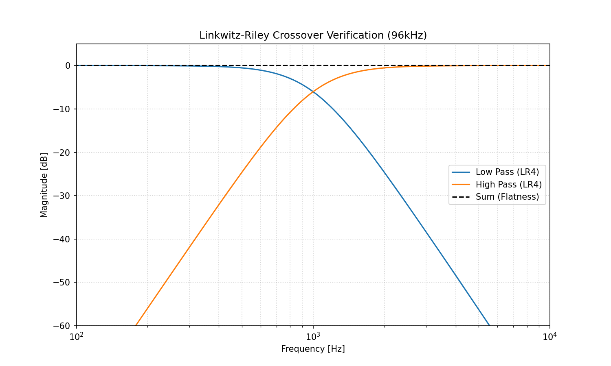

# PyOctaveBand: Technical Benchmark Report

Generated: 2026-01-07 09:42:54

## 1. Test Signal Parameters
- **Sample Rate:** 96.0 kHz
- **Duration:** 10.0 seconds
- **Signal Types:** White Noise (Stability) / Pure Sine (Precision)
- **Precision:** 64-bit Floating Point

## 2. Crossover (Linkwitz-Riley)

- **Flatness Error:** 0.000000 dB (Target < 0.01)

## 3. Precision & Isolation

| Type | Error (dB) | Isolation | Ripple | GD Std (ms) |
|:---|:---:|:---:|:---:|:---:|
| butter | 2.46e-03 | 31.3 dB | 0.2705 dB | 2847.826 |
| cheby1 | 3.38e-03 | 40.5 dB | 0.1000 dB | 3551.677 |
| cheby2 | 3.26e-03 | 57.8 dB | 29.4187 dB | 4790.013 |
| ellip | 9.41e-03 | 54.2 dB | 0.1000 dB | 4700.881 |
| bessel | 5.20e-01 | 32.5 dB | 5.9845 dB | 1380.212 |

## 4. Performance

| Channels | Exec Time (s) | Speedup |
|:---|:---:|:---:|
| 1 | 0.542 | 1.00x |
| 2 | 1.060 | 1.02x |
| 4 | 2.091 | 1.04x |
| 8 | 4.170 | 1.04x |
| 16 | 8.398 | 1.03x |