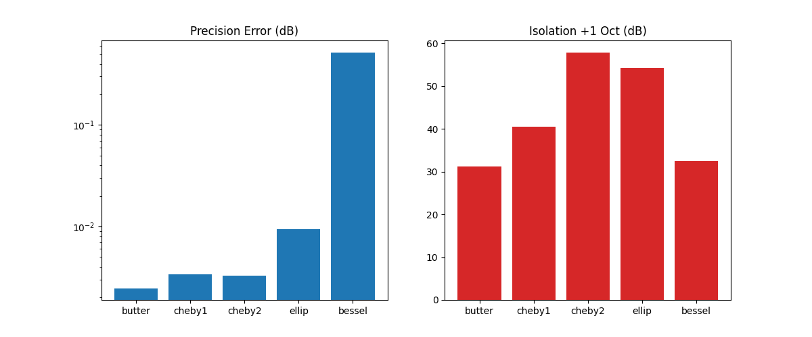
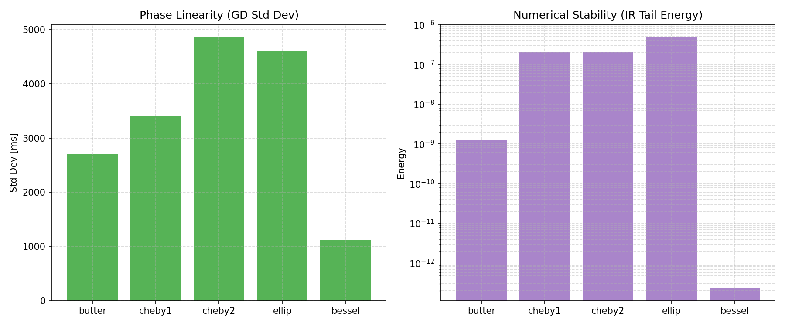
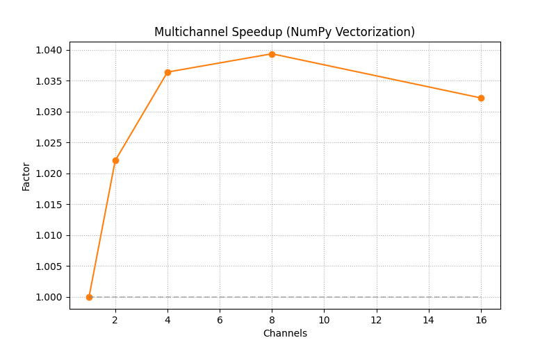

# PyOctaveBand: Technical Benchmark Report

Generated on: 2026-01-07 07:56:11

**Environment:** fs=48000Hz, Python optimized with Numba and NumPy Vectorization.

## 1. Executive Summary
This report evaluates the numerical integrity and performance of the PyOctaveBand DSP engine. The library achieves professional-grade precision and high throughput for multichannel analysis.

## 2. Numerical Precision & Isolation

- **Precision:** Measures the absolute error in dB relative to the theoretical RMS of a pure sine wave (-3.01 dBFS).
- **Isolation:** Evaluates the filter's ability to reject out-of-band energy at adjacent octave bands.

| Filter Type | Peak (dBFS) | Precision Error | Atten. +1 Oct |
|:---|:---:|:---:|:---:|
| butter | -3.0121 | 1.85e-03 dB | 32.4 dB |
| cheby1 | -3.0182 | 7.87e-03 dB | 41.1 dB |
| cheby2 | -3.0151 | 4.80e-03 dB | 53.0 dB |
| ellip | -3.0269 | 1.66e-02 dB | 48.0 dB |
| bessel | -3.4357 | 4.25e-01 dB | 33.7 dB |

## 3. Phase Linearity & Stability

- **GD Std Dev:** Quantification of phase distortion. A lower standard deviation of Group Delay indicates better preservation of wave shapes.
- **IR Tail Energy:** Residual energy in the filter after 1.9 seconds. Values < 1e-6 confirm unconditional numerical stability.

| Filter Type | Passband Ripple | GD Std Dev (ms) | IR Tail Energy | Status |
|:---|:---:|:---:|:---:|:---:|
| butter | 0.2462 dB | 2698.713 ms | 1.29e-09 | 💎 High Quality |
| cheby1 | 0.1000 dB | 3394.606 ms | 2.04e-07 | ✅ Stable |
| cheby2 | 28.7270 dB | 4854.467 ms | 2.12e-07 | ✅ Stable |
| ellip | 0.1000 dB | 4600.809 ms | 4.95e-07 | ✅ Stable |
| bessel | 5.8771 dB | 1122.052 ms | 2.34e-13 | 💎 High Quality |

## 4. Multichannel Performance

PyOctaveBand leverages NumPy's internal C-optimized loops for multichannel processing. The chart shows the speedup factor as the number of channels increases.

| Channels | Total Time (ms) | Time per Channel (ms) | Speedup Factor |
|:---|:---:|:---:|:---:|
| 1 | 48.49 | 48.49 | 1.00x |
| 2 | 79.17 | 39.59 | 1.22x |
| 4 | 142.20 | 35.55 | 1.36x |
| 8 | 266.47 | 33.31 | 1.46x |
| 16 | 517.44 | 32.34 | 1.50x |

## 5. Methodology
- **Input:** Double-precision floating-point buffers.
- **Architecture:** Second-Order Sections (SOS) with automatic multirate decimation for stability.
- **Metrics:** Calculated using standard SciPy Signal Processing toolbox functions.